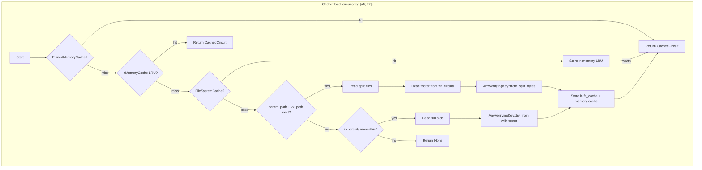

# ZK Circuit Cache Benchmarking Guide

> **Last updated:** 2026-07-15  
> **Scope:** `packages/vm/benches/main.rs` (ZK circuit benchmarks)  
> **Feature flag:** `zk` (enabled by default in `Cargo.toml`)

---

## 1. Architecture Overview

The ZK circuit cache uses a **three-tier architecture** — hot (pinned), warm (LRU), cold (filesystem) — modelled on the existing WASM module cache but extended with split-file storage and circuit-specific key derivation.



### 1.1 Cache Tiers

| Tier | Type | Eviction | Key Type | Latency Target |
|------|------|----------|----------|----------------|
| **Hot (Pinned)** | `HashMap<[u8;72], InstrumentedCircuit>` | Manual only (`unpin_circuit`) | `[u8; 72]` | < 1 µs |
| **Warm (LRU)** | `CLruCache<CacheKey, CacheEntry>` | Weight-based LRU | `CacheKey::CircuitKey([u8;72])` | < 5 µs |
| **Cold (FS)** | Serialised `AnyVerifyingKey` on disk | Manual removal | `[u8; 72]` → hex filename | 10–100 µs |

### 1.2 Three-Directory Storage Layout

```
state/wasm/
├── zk_param/          # IPA commitment params (split storage)
│   └── {36b-hex-key}.bin
├── zk_vk/             # CS + VK bytes (split storage)
│   └── {36b-hex-key}.bin
└── zk_circuit/        # Full blob: [params][cs][vk][footer] (monolithic)
    └── {72b-hex-key}.bin

cache/
└── modules/
    └── {version}/     # Wasmer serialised CachedCircuit (fast deserialisation)
        └── ...module
```

### 1.3 Key Derivation

```
param_key  = [4-byte appstate_key LE][32-byte param_checksum]   → 36 bytes
vk_key     = [4-byte appstate_key LE][32-byte vk_checksum]       → 36 bytes
circuit_key = [param_key 36 bytes][vk_key 36 bytes]              → 72 bytes
```

Where `appstate_key = u32::from_be_bytes([prover_id, curve_id, k, 0])`.

---

## 2. Footer Format Specification

The 80-byte `CircuitFooter` is appended to every monolithic circuit blob and is the authoritative source of split boundaries and integrity checksums.

### 2.1 Byte Layout

```
Offset  Size  Field          Description
──────  ────  ─────          ───────────
0       1     prover_id      Circuit type (0 = Plonkish)
1       1     curve_id       Curve (0 = Pasta/Vesta)
2       1     k              K parameter (log2(N))
3       1     i              Public input count
4       4     param_len      Length of IPA params (u32 LE)
8       4     cs_len         Length of constraint system (u32 LE)
12      4     vk_len         Length of verifying key (u32 LE)
16      32    param_checksum SHA-256 of params bytes
48      32    vk_checksum    SHA-256 of (cs + vk) bytes
──────  ────  ─────
Total:  80 bytes
```

### 2.2 Binary Layout (Visual)

```
┌─────┬─────┬─────┬─────┬──────────┬──────────┬──────────┬──────────────────────────┬──────────────────────────┐
│  0  │  1  │  2  │  3  │  4  ..  7 │  8 .. 11 │ 12 .. 15 │         16 .. 47         │         48 .. 79         │
├─────┼─────┼─────┼─────┼──────────┼──────────┼──────────┼──────────────────────────┼──────────────────────────┤
│ pid │ cid │  k  │  i  │ param_len │  cs_len  │  vk_len  │     param_checksum       │      vk_checksum         │
│ u8  │ u8  │ u8  │ u8  │  u32 LE  │  u32 LE  │  u32 LE  │     SHA-256  (32B)       │     SHA-256  (32B)       │
└─────┴─────┴─────┴─────┴──────────┴──────────┴──────────┴──────────────────────────┴──────────────────────────┘
```

### 2.3 Integrity Verification

The `check_circuit()` function (in `packages/vm/src/zk.rs`) performs:

1. **Length check**: `total_len >= 80` (rejects truncated data)
2. **Footer parsing**: `CircuitFooter::from_bytes(footer_bytes)` — validates 80-byte boundary
3. **Split body**: `param_bytes = bytes[..param_len]`, `vk_body = bytes[param_len..total_len-80]`
4. **Dual SHA-256 verification**:
   - `SHA256(param_bytes) == footer.param_checksum`
   - `SHA256(vk_body_bytes) == footer.vk_checksum`
5. **Error on mismatch**: Returns `ZkError::IntegrityErr` with detailed tracing log

### 2.4 Serialisation

```rust
// to_bytes() — writes the 80-byte footer
fn to_bytes(&self) -> [u8; 80] {
    bytes[0]   = self.prover_id;
    bytes[1]   = self.curve_id;
    bytes[2]   = self.k;
    bytes[3]   = self.i;
    bytes[4..8]   = self.param_len.to_le_bytes();
    bytes[8..12]  = self.cs_len.to_le_bytes();
    bytes[12..16] = self.vk_len.to_le_bytes();
    bytes[16..48] = self.param_checksum;
    bytes[48..80] = self.vk_checksum;
    bytes
}

// from_bytes() — validates length == 80, then reads fields
fn from_bytes(bytes: &[u8]) -> ZkResult<Self>;
```

### 2.5 VK Reconstruction

`AnyVerifyingKey::from_split_bytes(param_bytes, vk_body_bytes, footer)`:

1. `param_bytes` → `Params<VestaAffine>::read()` (IPA commitment params)
2. `vk_body_bytes` → split at `cs_len` offset:
   - `[..cs_len]` → `ConstraintSystem::read()` → install `CsBlueprint` (column structure)
   - `[cs_len..]` → `VerifyingKey::read_with_cs()` (halo2 VK deserialisation)
3. Assembles `CwVerifyingKey { params, vk, footer }`

---

## 3. Cache Operations

### 3.1 Store Circuit

```
store_circuit(zk: &[u8], persist: bool) → VmResult<[u8; 72]>
```

1. `check_circuit(zk)` — parse footer, verify dual SHA-256 checksums
2. If `persist`:
   - `save_circuit_to_disk()` → writes three files:
     - `zk_param/{param_key}.bin` = `params_bytes`
     - `zk_vk/{vk_key}.bin` = `cs_bytes + vk_bytes`
     - `zk_circuit/{circuit_key}.bin` = full blob (params + cs + vk + footer)
   - `pin_circuit()` → loads into `PinnedMemoryCache`
3. Returns `circuit_key`

### 3.2 Load Circuit

```
load_circuit(circuit_key: &[u8; 72]) → VmResult<Option<CachedCircuit>>
```

| Step | Tier | Action |
|------|------|--------|
| 1 | Pinned Memory | `HashMap::get()` — instant hit |
| 2 | Memory LRU | `CLruCache::get()` — weight update |
| 3 | File System Cache | Deserialise Wasmer module → store in memory LRU |
| 4 | Split files | `zk_circuit/` footer + `zk_param/` + `zk_vk/` → `from_split_bytes` |
| 5 | Monolithic | `zk_circuit/{key}.bin` → `AnyVerifyingKey::try_from` |

### 3.3 Remove Circuit

```
remove_circuit(circuit_key: &[u8; 72]) → VmResult<()>
```

**Current behaviour:**
- Removes `fs_cache` module entry
- Removes pinned memory entry
- Removes `zk_circuit/{key}.bin` from disk

**⚠️ Known issue:** Split files (`zk_param/` and `zk_vk/`) are **NOT** cleaned up by `remove_circuit`. They must be removed separately via `remove_vk_params()`.

### 3.4 Pin / Unpin Circuit

```
pin_circuit(circuit_key: &[u8; 72])     → VmResult<()>
unpin_circuit(circuit_key: &[u8; 72])   → VmResult<()>
```

`pin_circuit` first checks `PinnedMemoryCache`, then falls back to `FileSystemCache.load_circuit()`, then to split-file reconstruction. `unpin_circuit` removes from both pinned memory **and** the file system cache module entry.

---

## 4. Benchmarking Plan

### 4.1 Benchmark Suite

| Benchmark | Measures | Cache State | Expected Ratio |
|-----------|----------|-------------|----------------|
| `cold_load` | Full deserialisation from disk | Empty | 1× (baseline) |
| `warm_load` | LRU cache hit | Memory cache populated | ~10× faster |
| `hot_load` | Pinned memory hit | Pinned | ~100× faster |
| `store_time` | Write + checksum + pin | N/A | N/A |
| `split_vs_monolithic` | Split-file vs single blob | FS cache only | ~1–2× for split |
| `concurrent_load` | Mutex contention | Pinned | Degrades with threads |

### 4.2 Running Benchmarks

```bash
# All ZK circuit benchmarks
cargo bench --features zk -- zk_circuit

# Specific benchmark
cargo bench --features zk -- "ZK Circuit / hot_load"

# All benchmarks (including WASM)
cargo bench --features zk
```

### 4.3 Performance Targets

| Metric | Target | Notes |
|--------|--------|-------|
| Hot load (pinned) | < 1 µs | HashMap lookup + Arc clone |
| Warm load (LRU) | < 5 µs | CLruCache get + weight update |
| Cold load (FS module) | < 50 µs | Deserialise Wasmer module |
| Cold load (split-file reconstruct) | < 500 µs | Params::read + CS::read + VK::read |
| Store (persist + pin) | < 2 ms | 3× file write + footer parse + VK deserialise |
| Concurrent load (64 threads) | < 100 µs avg | Mutex contention under load |

### 4.4 Benchmark Implementation Details

```rust
// In benches/main.rs - behind #[cfg(feature = "zk")]

// 1. Cold load: fresh cache per iteration, circuit pre-stored on disk
fn bench_zk_circuit_cache(c: &mut Criterion) {
    let footer = CircuitFooter::from_bytes(
        &NORICK_CIRCUIT[NORICK_CIRCUIT.len() - COSMWASM_FOOTER_LENGTH..]
    ).unwrap();
    let circuit_key = footer.to_circuit_key();

    // Cold load - fresh cache each iteration
    group.bench_function("cold from filesystem", |b| {
        b.iter_batched(|| /* fresh cache */, |cache| {
            cache.load_circuit(&circuit_key).unwrap();
        }, BatchSize::SmallInput);
    });
}
```

---

## 5. Operational Tuning

### 5.1 Deployment Profiles

#### Validator Node

| Parameter | Recommended | Rationale |
|-----------|-------------|-----------|
| `memory_cache_size_bytes` | 2 GB | Large LRU for frequently-executed contracts |
| Pinned circuits | 10–20 most-used circuits | Avoid re-deserialisation on every block |
| `instance_memory_limit_bytes` | 256 MB | Ample for contract execution |
| Split-file storage | **Enabled** | Params can be shared across circuits |

#### RPC / Query Node

| Parameter | Recommended | Rationale |
|-----------|-------------|-----------|
| `memory_cache_size_bytes` | 4 GB | Higher query volume needs more LRU room |
| Pinned circuits | 50–100 circuits | Many concurrent queries hit different circuits |
| `instance_memory_limit_bytes` | 64 MB | Lower per-instance, more instances |
| Split-file storage | **Enabled** | Faster param sharing |

#### Archival Node

| Parameter | Recommended | Rationale |
|-----------|-------------|-----------|
| `memory_cache_size_bytes` | 512 MB | Minimal — most data comes from disk |
| Pinned circuits | 0 (disable) | Disk is the source of truth |
| `instance_memory_limit_bytes` | 64 MB | Conservative |
| Split-file storage | **Enabled** | Long-term data integrity |

### 5.2 Cache Sizing

```python
# Estimation formula for ZK circuit cache memory usage
# Each CachedCircuit ≈ AnyVerifyingKey ≈ params_size + cs_size + vk_size + 80 (footer)
# Typical norick_vk.bin: ~1.5 MB

circuit_count = 100
avg_circuit_bytes = 1_500_000  # ~1.5 MB per circuit
pinned_overhead = circuit_count * avg_circuit_bytes  # 150 MB for 100 circuits

lru_circuit_count = 200
lru_overhead = lru_circuit_count * avg_circuit_bytes  # 300 MB for 200 circuits

# Total: ~450 MB for 100 pinned + 200 LRU circuits
# Add 20% for HashMap/CLruCache overhead → ~540 MB
```

### 5.3 Disk I/O Tuning

- **File system**: Use SSD, avoid NFS. Circuit files are read sequentially (no random access).
- **Directory layout**: Three subdirectories (`zk_param/`, `zk_vk/`, `zk_circuit/`) with hex filenames keep directory listing fast even with 10K+ files.
- **Write amplification**: Each `store_circuit` writes three files. The total written is ~3× the blob size. For a 1.5 MB circuit, that's ~4.5 MB of disk writes.

### 5.4 Monitoring

Key metrics to expose:

```rust
pub struct ZkCacheMetrics {
    pub circuits_pinned: usize,       // count
    pub circuits_memory: usize,        // count
    pub circuits_fs: usize,            // count (approximate from directory)
    pub hits_pinned: u32,              // saturated counter
    pub hits_memory: u32,              // saturated counter
    pub hits_fs: u32,                  // saturated counter
    pub misses: u32,                   // saturated counter
    pub size_pinned: usize,            // bytes
    pub size_memory: usize,            // bytes
}
```

### 5.5 Known Pitfalls

1. **Split files not cleaned up on `remove_circuit`**: Always call `remove_vk_params` separately if split-file cleanup is needed.
2. **Pinned memory never evicted**: Circuits pinned via `pin_circuit` stay in memory until `unpin_circuit` is called. Unbounded pinning causes memory leaks.
3. **`from_bytes` vk_checksum uses relative offset**: The `from_bytes` implementation reads `bytes[bytes.len()-32..]` (last 32 bytes) rather than `bytes[48..80]` — this is intentional because the footer may be at the end of a larger buffer, but it means the footer must always be the last 80 bytes.
4. **`save_circuit_to_disk` vs `save_circuit_parts`**: The former is a test helper that writes all three files to the same directory; the latter is the production function that uses separate directories.
5. **Circuits in memory LRU share weight budget with WASM modules**: The `WeightScale` implementation sums both module and circuit `size_estimate` values, so large circuits can evict WASM modules from the shared LRU.

---

## 6. Appendix: Circuit Blob Anatomy

```
┌──────────────────────────────────────────────────────────────────────────────┐
│                        Full Circuit Blob                                     │
├────────────────────────────────┬──────────────────────────┬──────────────────┤
│        Params Bytes            │    CS + VK Bytes         │  Footer (80 B)  │
│     (param_len bytes)          │  (cs_len + vk_len bytes) │                  │
├────────────────────────────────┼──────────────────────────┼──────────────────┤
│ ┌──────────────────────────┐   │ ┌──────────────────┐     │ prover_id: 1B    │
│ │ halo2 Params<vesta::Aff> │   │ │ ConstraintSystem │     │ curve_id: 1B     │
│ │ (IPA commitment params)  │   │ │                  │     │ k: 1B            │
│ └──────────────────────────┘   │ ├──────────────────┤     │ i: 1B            │
│                                │ │ VerifyingKey     │     │ param_len: 4B    │
│                                │ │                  │     │ cs_len: 4B       │
│                                │ └──────────────────┘     │ vk_len: 4B       │
│                                │                          │ param_checksum:32B│
│                                │                          │ vk_checksum: 32B  │
└────────────────────────────────┴──────────────────────────┴──────────────────┘
```

## 7. cw-orch Circuit Key Integration

The `ZkCwEnv` trait in cw-orch uses `[u8; 72]` (binary circuit key) for all ZK circuit operations, NOT `Checksum` (32-byte hash). This is a fundamental difference from WASM module caching.

### Key Type Comparison

| Operation | WASM Module | ZK Circuit |
|-----------|-------------|------------|
| Identifier | `Checksum` (32 bytes) | `[u8; 72]` (circuit_key) |
| Store | `store_code(wasm, persist, pinned)` | `store_circuit(blob, persist)` → `[u8; 72]` |
| Load | `load_wasm(&checksum)` | `load_circuit(&[u8; 72])` |
| Pin | `pin(&checksum)` | `pin_circuit(&[u8; 72])` |
| Remove | `remove_wasm(&checksum)` | `remove_circuit(&[u8; 72])` |

### Key Derivation

```
circuit_key = [param_key (36)] [vk_key (36)] = 72 bytes

param_key = [appstate_key LE (4)] [SHA256(params) (32)] = 36 bytes
vk_key    = [appstate_key LE (4)] [SHA256(cs+vk) (32)] = 36 bytes
appstate_key = u32::from_be_bytes([prover_id, curve_id, k, 0])
```

### cw-orch Interface Sketch

```rust
pub trait ZkCwEnv {
    /// Store a ZK circuit blob and return the 72-byte circuit key.
    fn store_circuit(&self, blob: &[u8], persist: bool) -> Result<[u8; 72], Error>;

    /// Load a cached circuit by its 72-byte key.
    fn load_circuit(&self, key: &[u8; 72]) -> Result<Option<CachedCircuit>, Error>;

    /// Pin a circuit in memory (never evicted).
    fn pin_circuit(&self, key: &[u8; 72]) -> Result<(), Error>;

    /// Unpin a circuit from memory.
    fn unpin_circuit(&self, key: &[u8; 72]) -> Result<(), Error>;
}
```

### Why Binary, Not Checksum

- WASM modules use `Checksum` (SHA-256 of the wasm binary) for identity
- ZK circuits use a 72-byte key derived from the CircuitFooter — it encodes curve type, circuit size, AND dual checksums
- A 32-byte checksum is insufficient: two different circuits with the same params but different VKs would collide
- The 72-byte key is deterministic from the circuit blob — no external state needed

## 8. Generating Headstash Testdata

Before running the headstash benchmarks, generate the proving key:

```bash
cd ~/abstract/terp-core/crates/headstash
cargo run --release -p test-press -- --keys ./test-press/artifacts

# Copy to cosmwasm testdata
cp test-press/artifacts/headstash_vk.bin \
   ../cosmwasm/packages/vm/testdata/headstash_vk.bin
```

This generates a k=18, i=6 circuit (~800KB). The headstash circuit is ~12x larger than no_rick (k=10, ~66KB), which is useful for testing cache scaling behavior.

## 9. Run All Benchmarks

```bash
# Single-circuit cold/hot/warm + store time
cargo bench --features zk --bench zk_circuit -- "ZK / no_rick"

# Multi-tx benchmarks
cargo bench --features zk --bench zk_circuit -- "ZK / multi_tx"

# Memory usage (prints to stdout, not criterion)
cargo bench --features zk --bench zk_circuit -- "ZK / memory_usage"

# Power estimate
cargo bench --features zk --bench zk_circuit -- "ZK / power_estimate"

# Concurrent load
cargo bench --features zk --bench zk_circuit -- "ZK / concurrent_load"

# All ZK benchmarks
cargo bench --features zk --bench zk_circuit

# Compare with existing WASM benchmarks
cargo bench --features zk
```

## 10. Change History

| Date | Change |
|------|--------|
| 2026-07-15 | Initial version. Created benchmark suite, audit report, and documentation. |
| 2026-07-15 | Expanded benchmarks: multi-tx single/multi circuit, memory usage, power estimate. Added cw-orch key spec. |

| Date | Author | Changes |
|------|--------|---------|
| 2026-07-15 | Subagent | Initial document. Covers architecture, footer spec, benchmarks, ops tuning. |